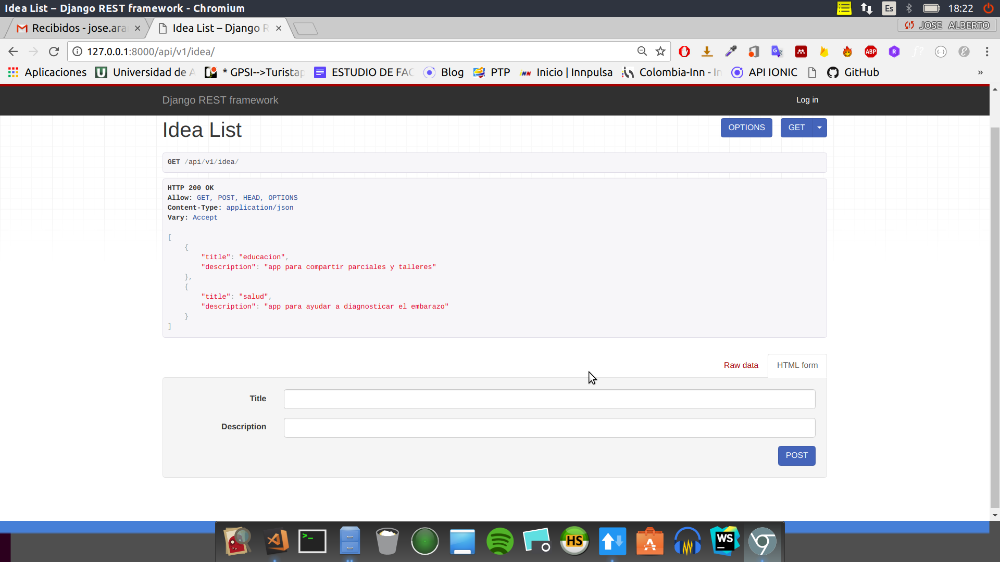
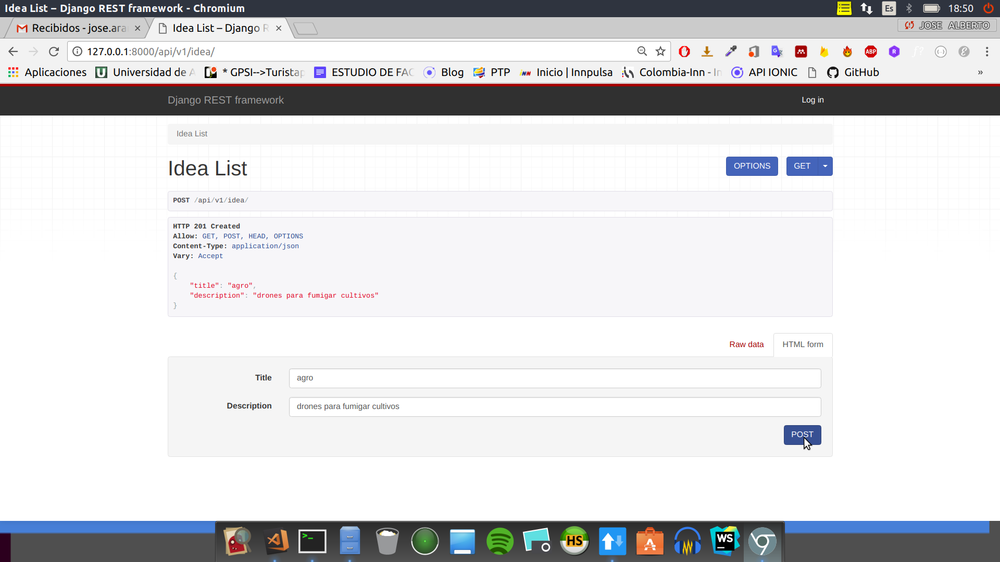
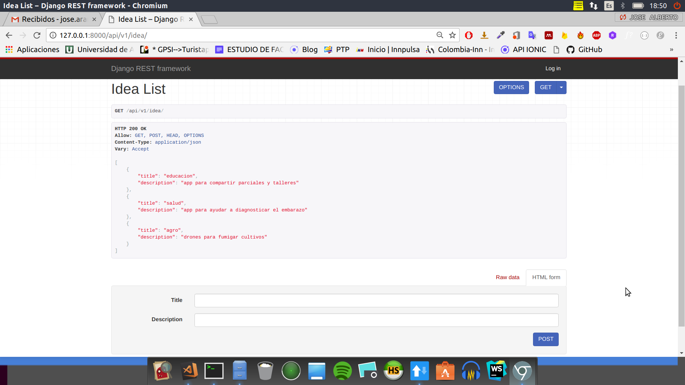
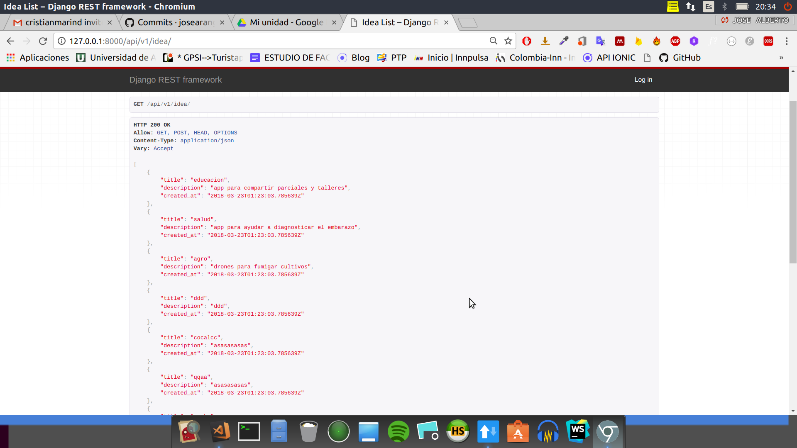

# dojoPython
# Se realizo un CRUD con un modelo llamado idea, el cual tiene dos campos title y descriptio

# Realizamos una peticion POST a nuestro servidor 

# Realizamos un GET de toda la lista de ideas a nuestro servidor

#Realizacion de un modificacion en el modelo para que se indique la fecha en la que fue creada la idea

